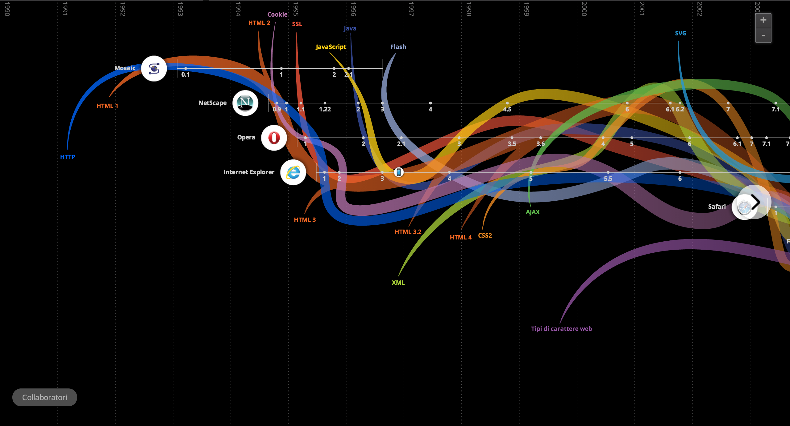
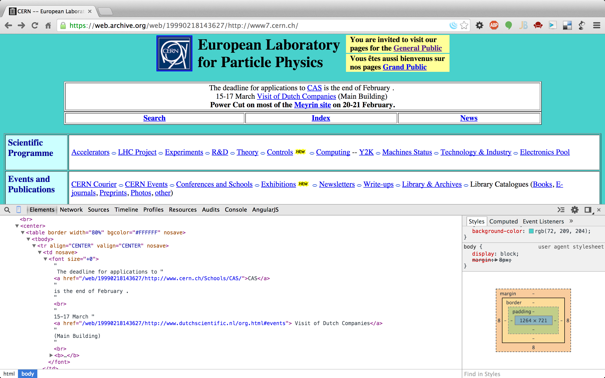
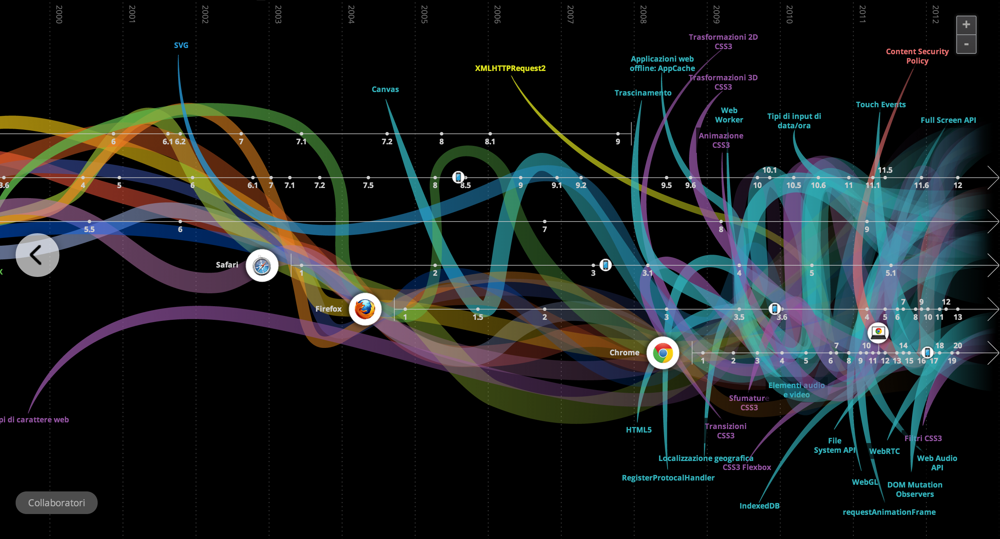
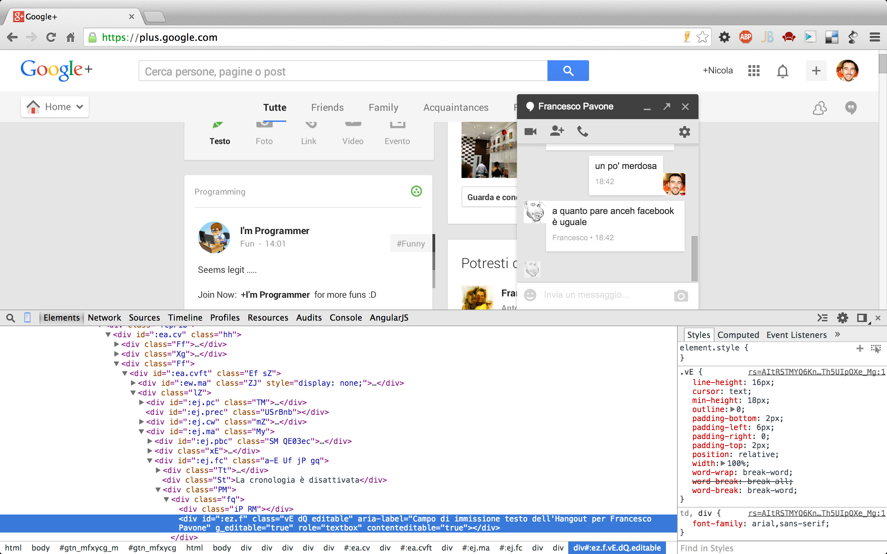
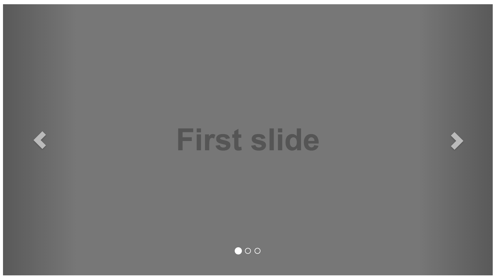
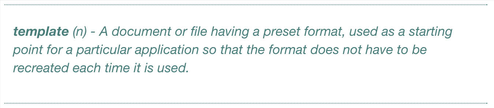
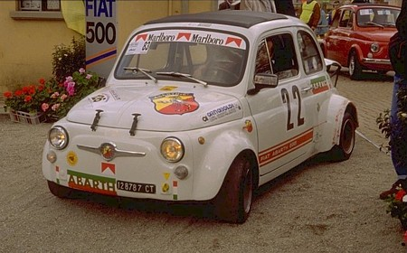
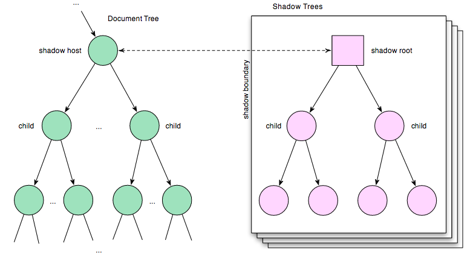
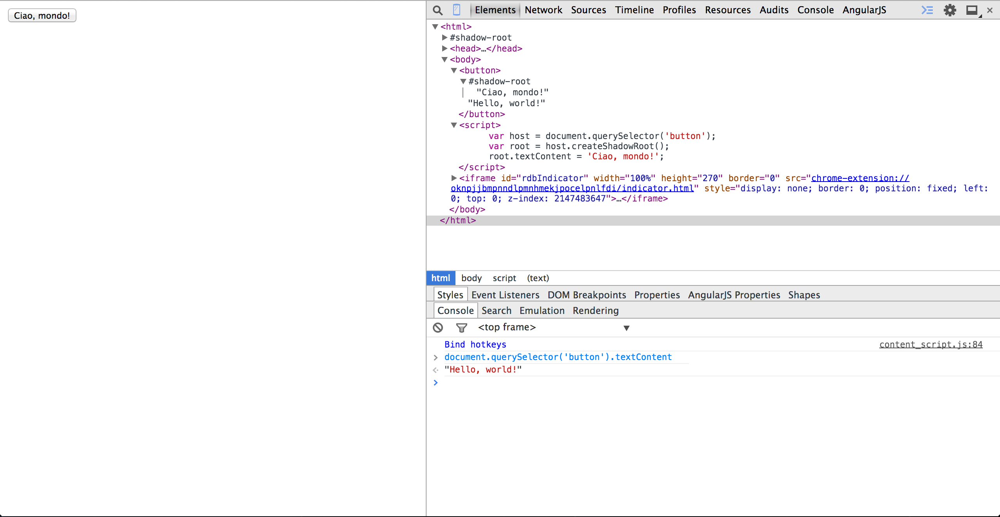
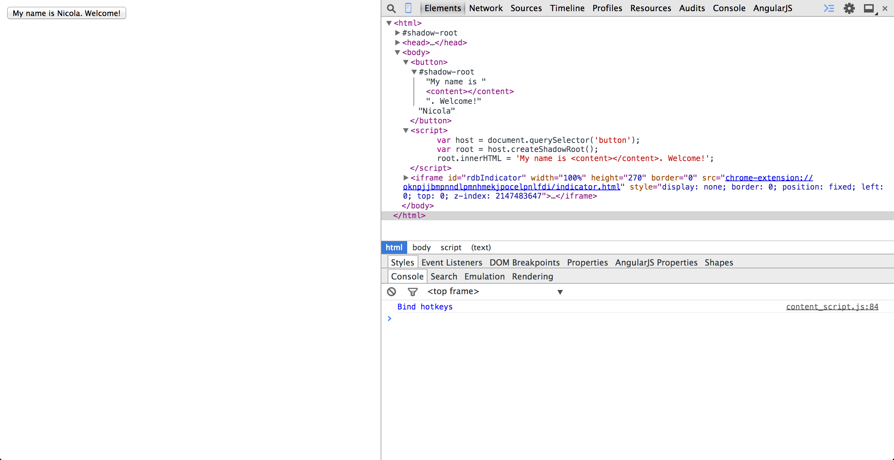

##Web Components
###Il modello a componenti per il Web
  

---

In principio il Web era semplice

----



----

Le nostre pagine erano semplici

----



----

Col passare tempo il Web è diventato più complesso

----



----

WebApp

----



----

Il Web è la piattaforma giusta per **ESEGUIRE** applicazioni?

<span class="fragment fade-in"></span>

----

Il Web è la piattaforma giusta per **DISTRIBUIRE** applicazioni?

<span class="fragment fade-in"></span>

----

Il Web è la piattaforma giusta per **REALIZZARE** applicazioni?

<span class="fragment fade-in"></span>

---

##Analizziamo il problema


----

Il Web è composto da **ELEMENTI**


----

Elementi **INCAPSULATI**

```xml
<select>
  <option>Small</option>
  <option>Medium</option>
  <option>Large</option>
  <option>X-Large</option>
  <option>XX-Large</option>
</select>
```

<select style="width: 200px">
  <option>Small</option>
  <option>Medium</option>
  <option>Large</option>
  <option>X-Large</option>
  <option>XX-Large</option>
</select>

----

Elementi **CONFIGURABILI**

```xml
<select id="size" size="6" multiple>
  <option disabled>Small</option>
  <option disabled>Medium</option>
  <option selected>Large</option>
  <option>X-Large</option>
  <option>XX-Large</option>
</select>
```

<select id="size" size="6" multiple style="width: 200px">
  <option disabled>Small</option>
  <option disabled>Medium</option>
  <option selected>Large</option>
  <option>X-Large</option>
  <option>XX-Large</option>
</select>

----

Elementi **COMPONIBILI**

```xml
<select>
  <optgroup label="Small">
    <option>Small</option>
  </optgroup>
  <optgroup label="Medium">
    <option>Medium</option>
  </optgroup>
  <optgroup label="Large">
    <option>Large</option>
    <option>X-Large</option>
    <option>XX-Large</option>
  </optgroup>
</select>
```

<select style="width: 200px">
  <optgroup label="Small">
    <option>Small</option>
  </optgroup>
  <optgroup label="Medium">
    <option>Medium</option>
  </optgroup>
  <optgroup label="Large">
    <option>Large</option>
    <option>X-Large</option>
    <option>XX-Large</option>
  </optgroup>
</select>

----

Elementi **PROGRAMMABILI**

```javascript
var foo = mySelect.selectedIndex;
```

----

Ma cosa succede se vogliamo costruire nuovi elementi?

----

###Carousel / Slideshow



----

###Carousel / Slideshow

```xml
<div id="carousel-example-generic" class="carousel slide" data-ride="carousel">
  <!-- Indicators -->
  <ol class="carousel-indicators">
    <li data-target="#carousel-example-generic" data-slide-to="0" class="active"></li>
    <li data-target="#carousel-example-generic" data-slide-to="1"></li>
    <li data-target="#carousel-example-generic" data-slide-to="2"></li>
  </ol>

  <!-- Wrapper for slides -->
  <div class="carousel-inner">
    <div class="item active">
      
      <div class="carousel-caption">
        ...
      </div>
    </div>
    <div class="item">
      
      <div class="carousel-caption">
        ...
      </div>
    </div>
    <div class="item">
      
      <div class="carousel-caption">
        ...
      </div>
    </div>
    <div class="item">
      
      <div class="carousel-caption">
        ...
      </div>
    </div>
    <div class="item">
      
      <div class="carousel-caption">
        ...
      </div>
    </div>
    <div class="item">
      
      <div class="carousel-caption">
        ...
      </div>
    </div>
  </div>

  <!-- Controls -->
  <a class="left carousel-control" href="#carousel-example-generic" role="button" data-slide="prev">
    <span class="glyphicon glyphicon-chevron-left"></span>
  </a>
  <a class="right carousel-control" href="#carousel-example-generic" role="button" data-slide="next">
    <span class="glyphicon glyphicon-chevron-right"></span>
  </a>
</div>
```

----

###Le pecche delle tecnologie Web

<ul>
  <li class="fragment fade-in">Riuso</li>
  <li class="fragment fade-in">Estendibilità</li>
  <li class="fragment fade-in">Incapsulamento</li>
  <li class="fragment fade-in">Modularità</li>
  <li class="fragment fade-in">Manutenibilità</li>
</ul>

----


----

###Carousel / Slideshow

```xml
<carousel>
  
  
  
</carousel>
```

---

Da oggi questo è possibile grazie a

##Web Components

<div class="fragment fade-in">

<br>
Hurray!
</div>

----

Una collezione di **standard emergenti**

che permettono agli sviluppatori di **estendere HTML**

----

Il mondo delle Web Components comprende:

* ###Template
* ###Custom Elements
* ###Shadow DOM
* ###HTML Imports

---

##Template


----



----

###&lt;template&gt;

Nuovo tag per il client-side templating DOM-based

----

###Come si usa

```xml
<template id="mytemplate">
  
  <div class="comment"></div>
</template>
```

----

Il contenuto di una template

* non viene renderizzato
* non ha side effects
* non figura direttamente nel DOM

----

###Come si attiva

```javascript
var t = document.querySelector('#mytemplate');
// Populate the src at runtime.
t.content.querySelector('img').src = 'logo.png';

var clone = document.importNode(t.content, true);
document.body.appendChild(clone);
```

----

###Esempio

```xml
<button onclick="useIt()">Use me</button>
<div id="container"></div>

<template>
  <div>Template used: <span>0</span></div>
  <_script_>alert('Thanks!')</_script_>
</template>
```

```javascript
function useIt() {
  var content = document.querySelector('template').content;
  // Update something in the template DOM.
  var span = content.querySelector('span');
  span.textContent = parseInt(span.textContent) + 1;
  document.querySelector('#container').appendChild(
      document.importNode(content, true));
}
```

<a href="template.html" taget="blank">template.html</a>

---

##Custom Elements



----

Permettono di definire nuovi tipi di elementi HTML

----

###Come definire un Custom Element

```javascript
var XFoo = document.registerElement('x-foo');
```
oppure

```javascript
var XFoo = document.registerElement('mega-button', {
  prototype: Object.create(HTMLButtonElement.prototype),
  extends: 'button'
});
```

----

Unica regola dei Custom Elements

<h3 class="fragment fade-in">Usare nomi con **"-"**</h3>

----

###Come utilizzare un Custom Element

```xml
<x-foo></x-foo>
```

oppure

```xml
<button is="mega-button">
```

----

###Metodi di lifecycle

```javascript
var MyElement = document.registerElement('my-element', {
  prototype: Object.create(HTMLElement.prototype),

  // createdCallback, attachedCallback, detachedCallback
  attributeChangedCallback: {
    value: function(attr, oldVal, newVal) {
      ...
    }
  }
});
```

----

**Custom Elements** + **Template**

```xml
<my-tag></my-tag>

<template id="my-template">
  <p>My markup was stamped from a &lt;template&gt;.</p>
</template>
```

```javascript
var proto = Object.create(HTMLElement.prototype, {
  createdCallback: {
    value: function() {
      var t = document.querySelector('#my-template');
      var clone = document.importNode(t.content, true);
      this.appendChild(clone);
    }
  }
});

document.registerElement('my-tag', { prototype: proto });
```

<a href="custom-elements.html" taget="blank">custom-elements.html</a>

---

##Shadow DOM


----

Risolve il problema dell’incapsulamento del DOM

----



----

###Come si usa

```xml
<button>Hello, world!</button>
```

```javascript
var host = document.querySelector('button');
var root = host.createShadowRoot();
root.textContent = 'Ciao, mondo!';
```

----



----

###Usare il conenuto dell'host

```xml
<button>Nicola</button>
```

```javascript
var host = document.querySelector('button');
var root = host.createShadowRoot();
root.innerHTML = 'My name is <content></content>. Welcome!';
```

----



----

**Shadow DOM** + **Custom Elements** + **Template**

```xml
<p>I'm out of Shadow DOM</p>
<my-tag>Nicola</my-tag>

<template id="my-template">
  <p>Hi <content></content>. I'm in Shadow DOM. My markup was stamped from a &lt;template&gt;.</p>
</template>
```

```javascript
var proto = Object.create(HTMLElement.prototype, {
  createdCallback: {
    value: function() {
      var t = document.querySelector('#my-template');
      var clone = document.importNode(t.content, true);
      this.createShadowRoot().appendChild(clone);
    }
  }
});

document.registerElement('my-tag', { prototype: proto });
```

```css
p { color: orange; }
```

<a href="shadow-dom.html" taget="blank">shadow-dom.html</a>

---

##HTML Imports


----

Un modo di includere documenti HTML

in altri documenti HTML

----

###Come si usa

```xml
<head>
  <link rel="import" href="/path/to/import/stuff.html">
</head>
```

```javascript
var content = document.querySelector('link[rel="import"]').import;
```

----

Attenti agli &lt;script&gt;:

* Vengono eseguiti all'import
* Non bloccano il parsing della main page
* Fanno riferimento a **"window"** del documento importatore

----

**All together now**

```javascript
var importDoc = document.currentScript.ownerDocument;

var proto = Object.create(HTMLElement.prototype, {
  createdCallback: {
    value: function() {
      var t = importDoc.querySelector('#my-template');
      var clone = document.importNode(t.content, true);
      this.createShadowRoot().appendChild(clone);
    }
  }
});

document.registerElement('my-tag', { prototype: proto });
```
<small>shadow-dom-for-import.html</small>

```xml
<head>
  <link rel="import" href="shadow-dom-for-import.html">
</head>
<body>
  <my-tag>Nicola</my-tag>
</body>
```
<small>shadow-dom-for-import.html</small>

<a href="imports.html" taget="blank">imports.html</a>

---

##Conclusioni

----

###Le pecche delle tecnologie Web

<ul>
  <li class="fragment fade-in"><strike>Riuso</strike> **(Template)**</li>
  <li class="fragment fade-in"><strike>Estendibilità</strike> **(Custom Elements)**</li>
  <li class="fragment fade-in"><strike>Incapsulamento</strike> **(Shadow DOM)**</li>
  <li class="fragment fade-in"><strike>Modularità</strike> **(HTML Imports)**</li>
  <li class="fragment fade-in"><strike>Manutenibilità</strike> **(Conseguenza degli altri)**</li>
</ul>


----

Questo significa che abbiamo risolto tutti i nostri problemi?


----


----

Polymer | X-Tag&nbsp;&nbsp;&nbsp;&nbsp;&nbsp;

 

----

##My two cents

Web Components + EcmaScript 6

svincolano il progettista di UX dai limiti del browser

----------

<div class="fragment fade-in">
Il futuro del Web passa da loro
<h3>Stay tuned!</h3>
</div>

---

#&lt;thank-you /&gt;

--------------------

|            |                                                                           |
|------------|---------------------------------------------------------------------------|
| _linkedin_ | [it.linkedin.com/in/nsanitate](http://it.linkedin.com/in/nsanitate)       |
| _twitter_  | [@n_sanitate](https://twitter.com/n_sanitate)                             |
| _gplus_    | [plus.google.com/+NicolaSanitate](http://plus.google.com/+NicolaSanitate) |
| _github_   | [github.com/nsanitate](https://github.com/nsanitate)                      |

----

##Riferimenti

* [hyperakt.com](http://hyperakt.com/items/google-evolution)
* [w3.org](http://www.w3c.org)
* [html5rocks.com](http://www.html5rocks.com)
* [css-trick.com](http://www.css-trick.com)
* [webcomponents.org](http://webcomponents.org)
* [polymer-project.org](https://www.polymer-project.org)
* [x-tags.org](http://x-tags.org)
